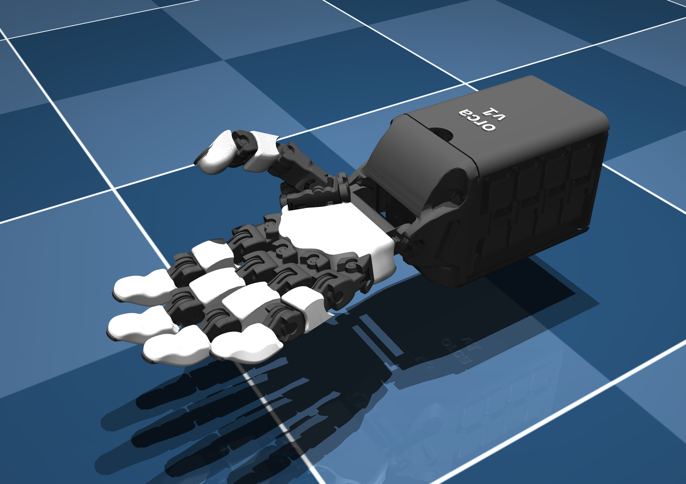
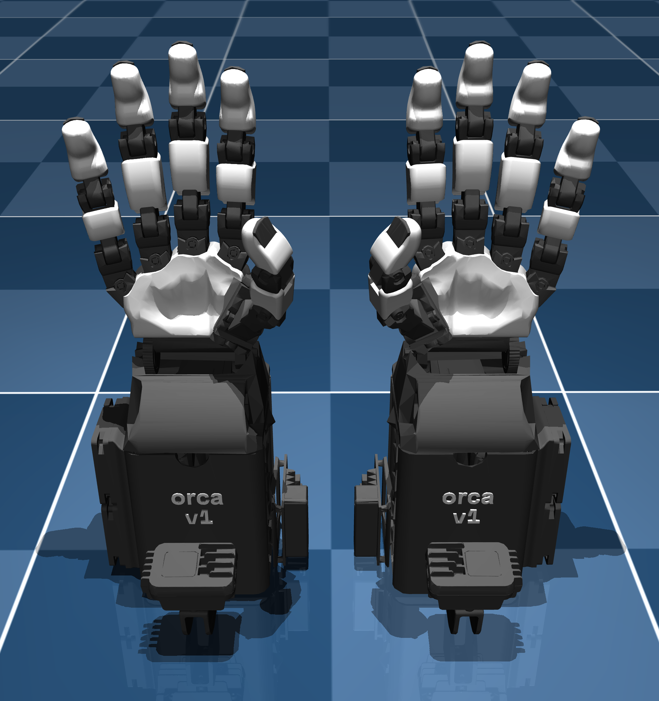

<div style="display: flex; gap: 10px;">
  
  
</div>

# Orcahand Description

This repository contains the description files for the Orcahand model (Both URDF and MJCF). The 'extended' version contains additional bodies (incl. inertial properties) such as the camera mount, the U2D2 board and fans.

## Example Usage
1. Clone the repository:
   ```bash
   git clone git@github.com:orcahand/orcahand_description.git
   cd orcahand_description
   ```
2. Install the required dependencies:
   ```bash
   pip install mujoco
   ```
3. Simulate the orcahand in mujoco:
   ```bash
   python3 -m mujoco.viewer --mjcf=scene_combined.xml
   ```

## Note on Meshes
Visual meshes contain the following amount of faces:
- Main tower, camera & fans: 15'000
- Rest of base: 2'000
- Skin: 5'000
- Rest: 500

Collision meshes contain the following amount of faces:
- Main tower, camera & fans: 7500
- Rest of base: 1000
- Skin: 500
- Rest: 250

You can further reduce or mirror meshes using the `utils/mesh_utils.py` script. With the same script, you can also print their number of faces. Some extra dependencies are required:
```bash
cd utils
pip install -r utils_requirements.txt
```

We can also recommend the VSCode extension `mtsmfm.vscode-stl-viewer` for quickly visualizing STL meshes.

## License

This project is licensed under the [MIT License](LICENSE).

## Contact

For questions or support, please contact the maintainers of this repo or the Orcahand team via our website ([https://orcahand.com](https://orcahand.com)).
